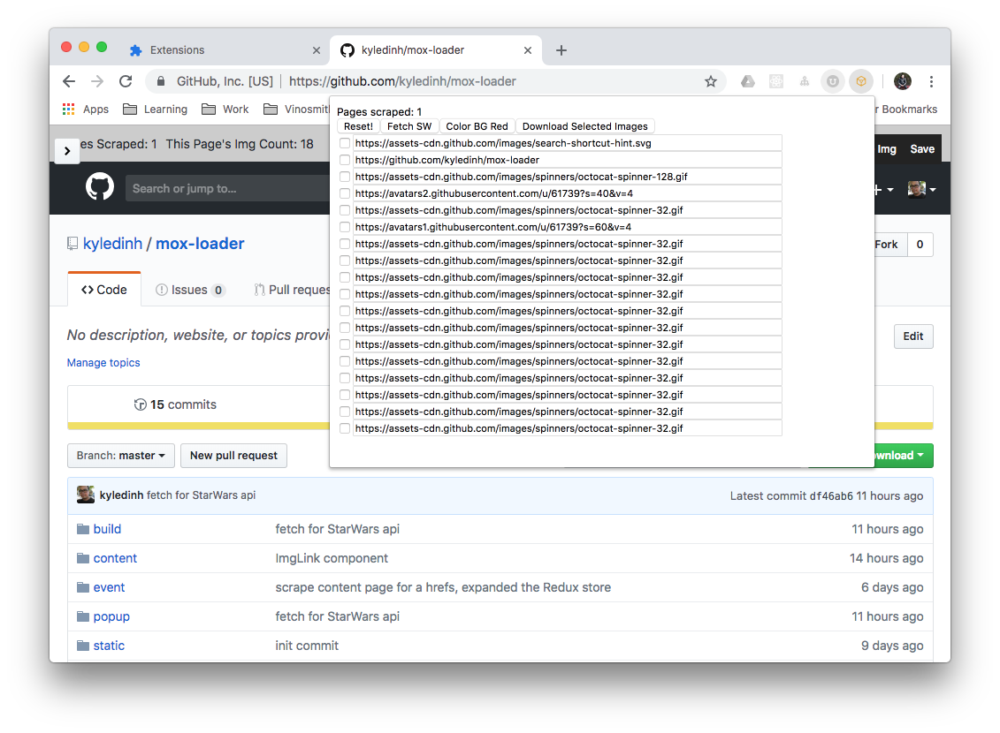

## Mox Loader Chrome Extension

To compile
* `npm start` creates `build/`
* In `chrome://extensions`, point the `Load unpacked` to this build directory to install in Developer mode

## Screenshot and pages
* `content` renders a top nav to each browser tab with two buttons
* `popup` is accessed from the extension icon on the top browser nav
* `event` is the background process to handle the state management

 

## Functionality
* From any tab, the `Scrape Img` button will scrape the current tab for any `` tag into an array. `Save` will update the Redux store with the array of `src` for each image and update a counter for the number of scrapes performed.
* The popup will display a form for all array of img srcs, allowing the user to select the img they desired to download with the `Download Selected Images`.
* The popup also has a `Reset` button to clear the Redux store. And a `Fetch SW` button that demonstrates a Fetch call to the Star Wars API for a list of 10 people.
* The `Color BG Red` button demonstrates the feature for injecting Javascript code back to the active tab. This simple feature will change that background color to red.   

## Resources
This project is based off from react-chrome-redux

* https://github.com/tshaddix/react-chrome-redux
* Great video: https://youtu.be/k88OIWJENgE
